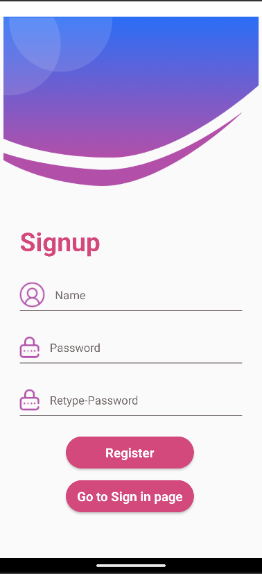
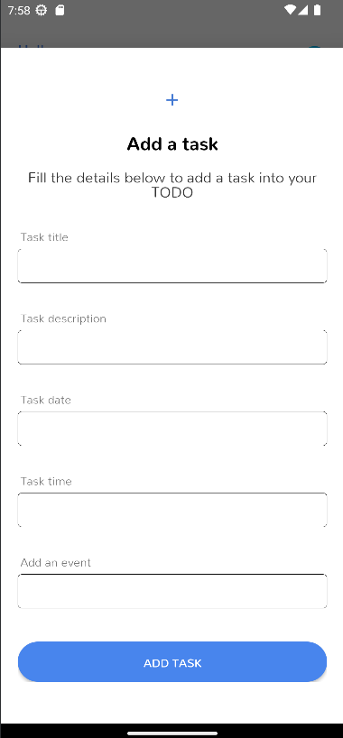

# 📚 StudyPulse - Android Productivity App

**StudyPulse** is an Android app designed to help students organize their study schedules, manage notes, and stay on top of tasks with reminders and alarms.

---

## 🚀 Features

- 🗓️ Task management with reminders  
- 📝 Note-taking and editing  
- ⏰ Alarm and notifications system  
- 🎨 Clean UI built with custom fonts and animations  
- 💾 Local storage using SQLite database  

---

## 🧰 Tech Stack

- **Language:** Java  
- **Framework:** Android SDK  
- **Database:** SQLite  
- **IDE:** Android Studio  

---

## ⚙️ Installation & Setup

Follow these steps to set up the project on your local machine:

```bash
git clone git@github.com:kalyani-pr/StudyPulse.git
1. Open the project in Android Studio

2. Let Gradle sync automatically

3. Build and run the project on an emulator or physical Android device

## 📂 Folder Structure

- **StudyPulse/**
  - **app/**
    - **src/**
      - **main/**
        - **java/com/example/studyplanner/**
        - **res/**
        - **AndroidManifest.xml**
  - **build.gradle**
  - **settings.gradle**
  - **README.md**


## 📸 Screenshots

### 🔐 Authentication Screens
<p align="center">    </p>

### 🧭 Main Features
<p align="center">    </p>

## 👩‍💻 Author

**Kalyani**
📧 [kalyanipr.dev@gmail.com](mailto:kalyanipr.dev@gmail.com)
🔗 [GitHub Profile](https://github.com/kalyani-pr)