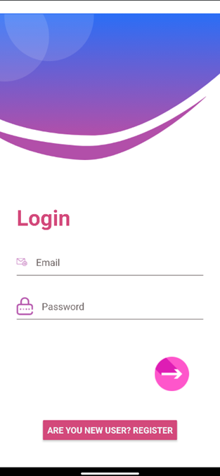
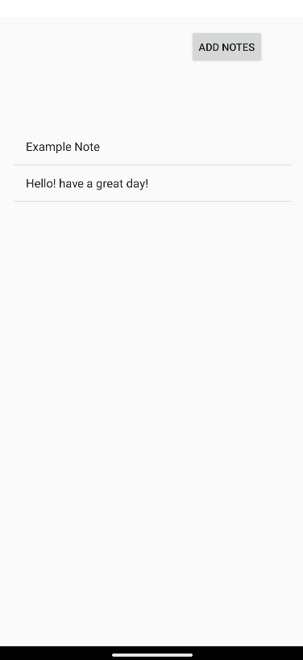

# 📚 StudyPulse - Android Productivity App

  
  
  
  
  
  
  

---

## 🧠 Overview

**StudyPulse** is an Android app designed to help students organize their study schedules, manage notes, and stay on top of tasks with reminders and alarms.
The app focuses on **productivity, simplicity,** and **clean UI design,** built using the **Android SDK** and **SQLite** for offline storage.

---

## ✨ Features  

- 🗓️ Task management with reminders  
- 📝 Note-taking and editing  
- ⏰ Alarm and notification system  
- 🎨 Custom XML-based UI with animations and fonts  
- 💾 Offline data storage using SQLite  
 
 
---

## 🧩 Tech Stack  

| Category | Technology |
|-----------|-------------|
| 💻 **Language** | Java |
| 🎨 **UI Design** | XML Layouts |
| 🧠 **Framework** | Android SDK |
| 🗃️ **Database** | SQLite |
| 🧰 **IDE** | Android Studio |  

---

## ⚙️ Installation & Setup

Follow these steps to set up the project on your local machine:

1. Clone the repository using SSH:  
   `git clone git@github.com:kalyani-pr/StudyPulse.git`

2. Open the project in **Android Studio**.  
3. Let **Gradle** sync automatically.  
4. Build and run the project on an **emulator** or **physical Android device**.  

---

## 📁 Folder Structure

- **StudyPulse/**
  - **app/**
    - **src/**
      - **main/**
        - **java/com/example/studyplanner/**
        - **res/**
        - **AndroidManifest.xml**
  - **Screenshots/**
  - **build.gradle**
  - **settings.gradle**
  - **README.md**

---

## 📸 Screenshots

### 🔐 Authentication Screens  

|  |  |  |
|:---:|:---:|:---:|
| **Auth Screen** | **Login Screen** | **Signup Screen** |

### 🧭 Main Features  

|  |  |  |
|:---:|:---:|:---:|
| **Dashboard** | **Notes** | **Tasks** |

---

## 🚀 Future Enhancements

- ☁️ Cloud backup using Firebase

- 🤖 Integrate AI-powered chatbot for interactive learning assistance

- 🏆 Add user scoreboards to encourage competition and boost confidence

- 📊 Implement progress tracking with detailed statistics

---

## 👩‍💻 Author

**Kalyani P R**  
📧 [kalyanipr.dev@gmail.com](mailto:kalyanipr.dev@gmail.com)  
🔗 [GitHub Profile](https://github.com/kalyani-pr)

---

## 🪪 License  

This project is licensed under the **MIT License** — feel free to use, modify, and distribute.  
See the LICENSE file for details.

---