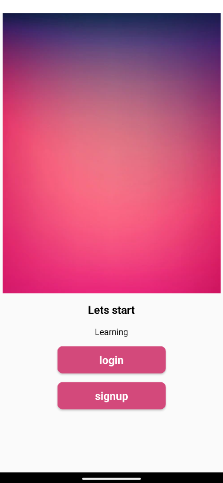

# 📚 StudyPulse - Android Productivity App

**StudyPulse** is an Android app designed to help students organize their study schedules, manage notes, and stay on top of tasks with reminders and alarms.

---

## 🚀 Features

- 🗓️ Task management with reminders  
- 📝 Note-taking and editing  
- ⏰ Alarm and notifications system  
- 🎨 Clean UI built with custom fonts and animations  
- 💾 Local storage using SQLite database  

---

## 🧰 Tech Stack

- **Language:** Java  
- **Framework:** Android SDK  
- **Database:** SQLite  
- **IDE:** Android Studio  

---

## ⚙️ Installation & Setup

Follow these steps to set up the project on your local machine:

1. Clone the repository:
   ```bash
   git clone git@github.com:kalyani-pr/StudyPulse.git
2. Open the project in Android Studio.

3. Let Gradle sync automatically.

4. Build and run the project on an emulator or Android device.

## 📂 Folder Structure

StudyPulse/
├── app/
│ ├── src/
│ │ ├── main/
│ │ │ ├── java/com/example/studyplanner/
│ │ │ ├── res/
│ │ │ └── AndroidManifest.xml
├── build.gradle
├── settings.gradle
└── README.md


## 📸 Screenshots

### 🔐 Authentication Screens
<p align="center">
  
  
  
</p>

### 🧭 Main Features
<p align="center">
  
  
  
</p>

## 👩‍💻 Author

**Kalyani**
📧 [kalyanipr.dev@gmail.com](mailto:kalyanipr.dev@gmail.com) 
🔗 [GitHub Profile](https://github.com/kalyani-pr)